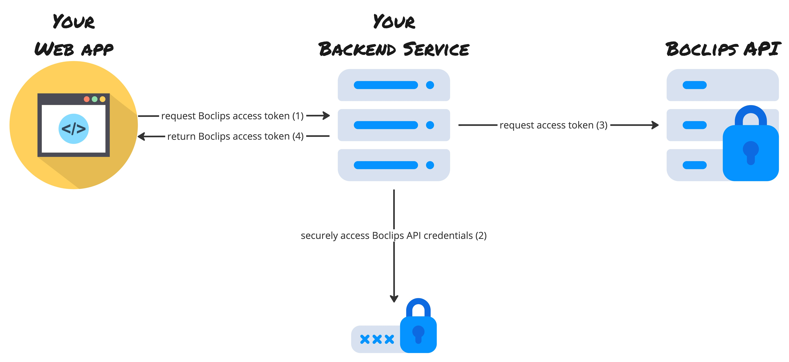

= Getting Started With Boclips API
Delivered to you by Boclips Engineering
:version-label: API Version
:doctype: book
:icons: font
:source-highlighter: highlightjs
:sectlinks:
:stylesheet: ../styles.css

[.text-center]
=== link:authenticating.html[Previous: _Authenticating_]

== Calling the Boclips API from your web app

As described in the section about authenticating, in order to successfully issue a call against Boclips API, you need to retrieve our access token and send it over in the `Authorization` header of any subsequent HTTP requests, for example using https://axios-http.com/[Axios^]:

[source,javascript]
const response = await axios.get('https://api.boclips.com/v1/videos', { <1>
  headers: {
    'Authorization': `Bearer ${boclipsAccessToken}`
  }
})

<1> _Hardcoded URL is used here for simplicity, but you should consider using the link:/docs/api-guide/index.html#overview-hypermedia[links^] exposed by Boclips API in your real implementation_

The `response` will contain a resource object — in the case of the example above it will be a list of video metadata entries. Please refer to the link:/docs/api-guide/index.html#resources[detailed API guide^] for resource details.

=== Keeping Secrets a Secret

So far so good, but an important thing to consider is where the `boclipsAccessToken` is coming from.

If the web app acquires the access token by itself, it means that the client id and secret become exposed in its source code, effectively disclosing them to anyone who knows their way around the web browser's developer tools! 🙀

The way our customers usually tackle this issue is by running an additional backend service that retrieves the access token on web app's behalf.

[.text-center]
=== link:integrating-a-boclips-player.html[Next: _Integrating the Boclips Player_]
